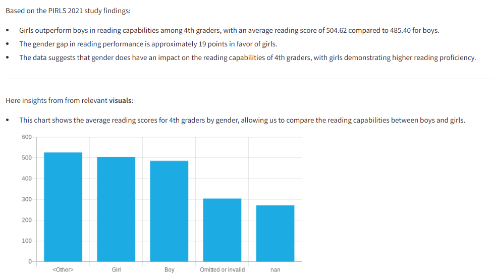
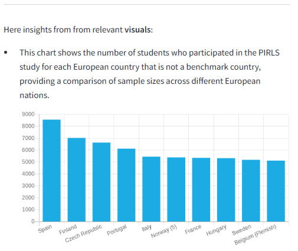

# GDSC7 - from AgentFOX🦊

---
### Capgemini Global Data Science Challenge (GDSC).
### The grade-AI generation edition. Re-righting Education with data & AI!
---

|||
| :-- | :-: |
| GDSC is the **Capgemini** AI event of the year. This 7th edition is about partnership with **UNESCO**, using Large Language Models (LLM) for tackling challenges in education by analyzing massive amounts of data collected from the *Progress in International Reading Literacy Study* (PIRLS). |  |
|||


<!-- TABLE OF CONTENTS -->
<details>
  <summary>Table of Contents</summary>
  <ol>
    <li>
      <a href="#-about-the-project">🚀 About The Project</a>
      <ul>
        <li><a href="#built-with">Built With</a></li>
      </ul>
    </li>
    <li>
      <a href="#-documentation">📚 Documentation</a>
      <ul>
        <li><a href="#file-structure">File Structure</a></li>
        <li><a href="#usage">Usage</a></li>
        <li><a href="#guidelines">Guidelines</a>
            <ul>
              <li><a href="#custom-langChain-sql-toolkit">Custom LangChain SQL Toolkit</a></li>
              <li><a href="#visualization-section">Visualization section</a></li>
              <li><a href="#prompt-engineering-techniques">Prompt Engineering techniques</a></li>
            </ul>
        </li>
      </ul>
    </li>
    <li><a href="#author">Author</a></li>
    <li><a href="#acknowledgments">Acknowledgments</a></li>
  </ol>
</details>

<!-- ABOUT THE PROJECT -->
## 🚀 About The Project
Reading is an educational skill that empowers people to make sense of the world. Reading enhances critical thinking, builds empathy, and fosters understanding of different cultures. A human skill that unites us across borders and can help us thrive in a complex, information-driven world.

The **PIRLS** study is the global standard for assessing trends in reading achievement in the fourth grade. It provides worldwide comparative data on how well children read and offers policy-relevant information for improving learning and teaching. Assessing reading achievement provides educators and policymakers insights into the effectiveness of their education system and helps to identify areas for improvement.

The study is done at the most important transition stage in children's reading development: the change from learning to read to reading to learn.
 
This project shows how to connect the latest developments in Generative Artificial Intelligence (**GenAI**), LLM, and **Agentic Systems**, with this study to gather fast insights with a matter of *prompt*.


### Built With

- **LLM**: Anthropic Sonnet 3.5 as a foundation model.
- **LLM Orchestrator**: LangChain, LangGraph ReAct agent, from building the flow from the initial prompt to the interaction with Agents & Tools to the final output. Database, Query generation and execution, visualization configuration, and insights synthetization.
- **Database**: PostgreSQL for the PIRLS dataset.
- **AWS Cloud Platform**: Amazon SageMaker, Bedrock, CodeCommit, ECS.
- **Data Visualization**: QuickChart for chart creation.


## 📚 Documentation

### File Structure
```
├── img/
├── src/
│   ├── static/
│   │   ├── __init__.py
│   │   ├── app.py
│   │   ├── ChatBedrockWrapper.py
│   │   ├── submission.py
│   │   └── util.py
│   ├── submission/
│   │   ├── crews/ 
│   │   │   ├── agentFOX_tool.py    # The main Agentic flow 
│   │   │   ├── util.py             # The custom Agent Toolkit Classes
│   │   │   └── __init__.py
│   │   ├── create_submission.py
│   │   └── __init__.py
│   └── __init__.py
├── README.md                       # Project documentation
└── requirements.txt                # Python dependencies
```

### Usage

Important Note: **requires AWS credentials** and **PIRLS database connection credentials**

*Installing the necessary libraries*
```
!pip install -r ./requirements.txt
```

*Load modules*
```
import dotenv

from src.static.ChatBedrockWrapper import ChatBedrockWrapper
from src.static.submission import Submission
from src.submission.crews.agentFOX_tools import AgentFOXPIRLSCrew

dotenv.load_dotenv()
```

*Set up the LLM and Agents*
```
MODEL_ID = "anthropic.claude-3-5-sonnet-20240620-v1:0"
chat_model = ChatBedrockWrapper(model_id=MODEL_ID, model_kwargs={'temperature': 0.2}, call_id=call_id)
crew = AgentFOXPIRLSCrew(chat_model)
```

*Prompt the model*
```
%%time
my_query = "Does the gender of a child have an impact on the reading capabilities of 4th graders? Base your answer on the findings of the PIRLS 2021 study."
my_answer = crew.run(my_query)
```

*Display the output*
```
# output is in markdown format
from IPython.display import display, Markdown
display(Markdown(my_answer))
```



### Guidelines

#### Custom LangChain SQL Toolkit
LangChain uses the concept of toolkits, as an abstraction that groups tools designed to be used in an ensemble or sequentially for specific tasks. The tools in the SQLDatabaseToolkit interact with SQL databases. Includes:
- <ins>QuerySQLDataBaseTool</ins>: return the result from the database based on the SQL query provided. In case of an error, it rewrites the query, checks the queries (using QuerySQLCheckerTool), and tries again. It also interacts with ListSQLDatabaseTool and InfoSQLDatabaseTool to better understand the database.
- <ins>InfoSQLDatabaseTool</ins>: it provides the schema and sample rows for the database tables.
- <ins>ListSQLDatabaseTool</ins>: this tool return the table names.
- <ins>QuerySQLCheckerTool</ins>: the tool double-checks if the query is correct before executing it.

The tools in the toolkit are important, ListSQLDatabaseTool and QuerySQLCheckerTool are guardrails, InfoSQLDatabaseTool and QuerySQLDataBaseTool have been customized.

- *QuerySQLDataBaseTool* is modified to include to the SQL query expression, extra parameters specifically to allow the Agents to generate all the configurations needed for chart visualizations.

```
# in src.submission.crews.util
class _QuerySQLDataBaseToolInputV2(BaseModel):
    query: str = Field(..., description="A detailed and correct SQL query. Must be simple to visualize in one of 2D chart, bar, line, scatter, with max 10 values.")
    chart: str = Field(..., description="2D chart. Can ONLY be: bar, line, scatter, None")
    x_axis_chart: str = Field(..., description="name of the column of the chart x axis. If chart is None, x axis is also None.")
    y_axis_chart: str = Field(..., description="name of the column of the chart y axis. If chart is None, y axis is also None.")
    chart_explanation: str = Field(..., description="Explaination of what insight from this chart relevant to the user ask. If chart is None, chart_explanation is also None.")
```
The next Visualization section covers it in more detail, exploring the benefits.


- *InfoSQLDatabaseTool* is an indirect semantic layer that explains the database to the LLM.

There is no *one-size-fits-all* and the default InfoSQLDatabaseTool treats every table the same, returning the schema and the same number of rows of examples.

But every table is different and contains different types of information. Some are simple and more structured and include IDs and numbers. Some others contain unstructured data, and more examples are needed to be better understood by an LLM.

Hence, InfoSQLDatabaseTool is modified and adapted for each group of PIRLS tables:
- For the following tables, the setting is up to 200 examples. It increases the LLM understanding of information such as available education systems, and the PIRL questions, which are unstructured text data.
```
# in src.submission.crews.util
['benchmarks', 'countries', 'studentscoreentries', 'studentquestionnaireentries', 'schoolquestionnaireentries', 'homequestionnaireentries', 'curriculumquestionnaireentries']
```
- For the other tables, the setting is up to 5 examples.


#### Visualization section
As mentioned in the previous section, *QuerySQLDataBaseTool* has been modified to include extra parameters specifically to allow the Agents to generate all the configurations needed for chart visualization.
- Based on the user input, the LLM can return chart configurations.
- If any, these configurations are processed, and cleaned and the charts are generated with QuickChart.
- To the final output, a section highlighting relevant visuals is added with a short description. Like the following.



What are the benefits?
- The LLM triggers an Agent to do multiple things: make a query that can be visualized with a clear x-axis and y-axis and need to be able to describe it too, and then get the output.
- Return the parameters and process them with QuickChart, save the image in the s3 bucket. Pass the image URL to the markdown.
- By doing this, the Agent is instructed to keep the insights simple and coherent with the user input prompt, the SQL query, and the chart.

Losing control over very complex queries, many resource-intensive iterations, and being prone to errors and hallucination are concerns with SQL Agents. One direct chain of thoughts technique reduces errors and adds extra cautions and guardrails, reducing latency and token resources and making the solution more sustainable.

#### Prompt Engineering techniques
Few precautions has been taken to improve the LLM ability to follow instructions, like the capitalizations of some words like:
```
DO NOT, MAX, ONLY, ALWAYS, Prefer, BUT, MUST
```

<!-- AUTHOR -->
### Author
- Pierluigi Costanzo (pierluigi.costanzo@capgemini.com)


<!-- ACKNOWLEDGMENTS -->
## Acknowledgments
Helpful resources and credits to:

* [Capgemini GDSC](https://gdsc.ce.capgemini.com/app/)
* [GitHub GDSC7](https://github.com/cg-gdsc/GDSC-7/)
* [PIRLS 2021 Study](https://pirls2021.org/)